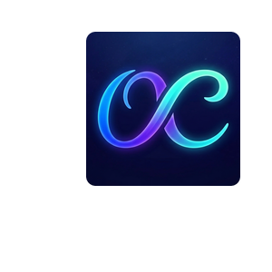

# OmniConsole

> 🌐 **English** | [繁體中文](README.zh-TW.md)

<p align="center">

</p>

<p align="center">
<a href="https://github.com/8bit2qubit/OmniConsole/releases/latest"></a>
<a href="https://github.com/8bit2qubit/OmniConsole/releases"></a>
<a href="#"></a>
<a href="https://github.com/8bit2qubit/OmniConsole/blob/main/LICENSE"></a>
</p>

A custom **WinUI 3 gaming platform launcher** designed to replace the default Windows 11 **Full Screen Experience (FSE) Home shell**, providing a seamless, console-like boot experience for gaming PCs and handhelds.

---

## 💡 What is OmniConsole?

OmniConsole turns your Windows PC or handheld device (ROG Xbox Ally, etc.) into a console-like experience. When you press the **Xbox button**, OmniConsole launches your preferred gaming platform automatically.

### How It Works

```
Power on / Xbox button → OmniConsole activates → Launches your chosen platform → Hides itself
```

The app registers as a Windows 11 Full Screen Experience Home App through the official FSE API.

---

## ✨ Features

- **Automatic Platform Launch** – Launches your configured gaming platform on activation.
- **Multi-Platform Support** – Supports **Steam Big Picture**, **Xbox App**, and **Epic Games Launcher**.
- **Dedicated Settings Entry** – A separate "**OmniConsole Settings**" entry appears in All Apps, so you can change your default platform anytime without interfering with the FSE behavior.
- **Native FSE Integration** – Registered as a Windows 11 Full Screen Experience Home App through the official FSE API.

---

## ⚙️ Prerequisites

Before installing OmniConsole, you need to enable the Windows 11 Full Screen Experience feature:

- **Desktops & Laptops**: Use [Xbox Full Screen Experience Tool](https://github.com/8bit2qubit/XboxFullScreenExperienceTool) to enable FSE first.
- **Native Handheld Devices** (e.g., ROG Xbox Ally series): These devices natively support FSE. You can skip the Xbox Full Screen Experience Tool and install OmniConsole directly.

---

## 🚀 Quick Start

### 1. Install OmniConsole

1.  Download the latest `.msix` package from the [**Releases Page**](https://github.com/8bit2qubit/OmniConsole/releases/latest).
2.  Install the self-signed certificate to your **Trusted People** certificate store (included in the release).
3.  Double-click the `.msix` file to install.

### 2. Configure Your Default Platform

1.  Open **"OmniConsole Settings"** from the Start Menu (All Apps).
2.  Select your preferred gaming platform:
    - **Steam Big Picture**
    - **Xbox App**
    - **Epic Games Launcher**
3.  Click **Save Settings**.

### 3. Set as FSE Home App

1.  Go to **Settings → Gaming → Full Screen Experience**.
2.  Set "Choose Home app" to **OmniConsole**.
3.  Enable **"Enter full screen experience on startup"** (optional).

### 4. Done!

Press the **Xbox button** — OmniConsole will instantly launch your chosen platform and hide itself.

---

## 💻 Tech Stack

- **Primary Stack**: C# & .NET 8
- **UI Framework**: WinUI 3
- **Packaging**: MSIX

---

## 🛠️ Local Development

1.  **Clone the Repository**

    ```bash
    git clone https://github.com/8bit2qubit/OmniConsole.git
    cd OmniConsole
    ```

2.  **Open in Visual Studio**

    Open `OmniConsole.sln` with Visual Studio 2022 (17.0+). Ensure the **Windows App SDK** workload is installed.

3.  **Run for Development**

    Set the build configuration to `Debug`, select your platform (`x64` / `ARM64`), and press `F5`.

---

## 📄 License

This project is licensed under the [GNU General Public License v3.0 (GPL-3.0)](https://github.com/8bit2qubit/OmniConsole/blob/main/LICENSE).

You are free to use, modify, and distribute this software, but any derivative works must also be distributed under the **same GPL-3.0 license and provide the complete source code**. For more details, see the [official GPL-3.0 terms](https://www.gnu.org/licenses/gpl-3.0.html).
