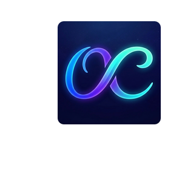
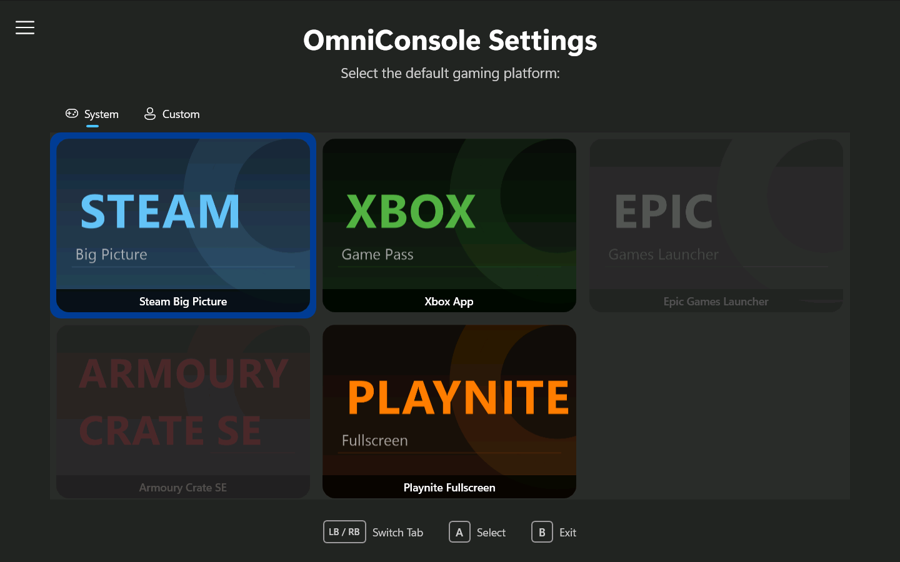
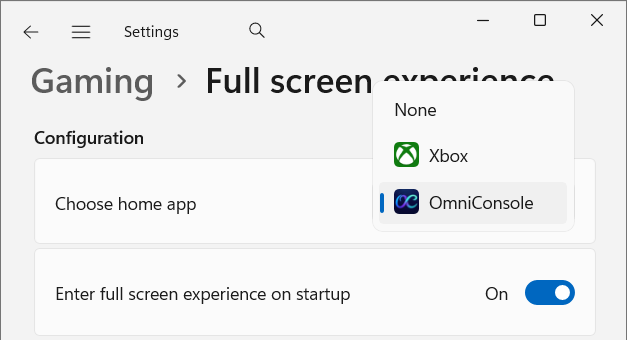

# OmniConsole

> 🌐 **English** | [繁體中文](README.zh-TW.md)

<p align="center">

</p>

<p align="center">
  
</p>

<p align="center">
<a href="https://github.com/8bit2qubit/OmniConsole/releases/latest"></a>
<a href="https://github.com/8bit2qubit/OmniConsole/releases"></a>
<a href="#"></a>
<a href="https://github.com/8bit2qubit/OmniConsole/blob/main/LICENSE"></a>
</p>

A custom **WinUI 3 gaming platform launcher** designed to replace the default Windows 11 **Full Screen Experience (FSE) Home shell**, providing a seamless, console-like boot experience for gaming PCs and handhelds.

---

## 💡 What is OmniConsole?

OmniConsole serves as the Windows 11 Full Screen Experience (FSE) Home shell on your PC or handheld device (ROG Xbox Ally, etc.), launching your chosen gaming platform automatically whenever FSE is activated. The default FSE Home only supports the Xbox App — OmniConsole removes this limitation, letting you choose from:

- **On boot**: With "Enter full screen experience on startup" enabled, your gaming platform launches automatically at boot.
- **During use**: Press the **Xbox button**, then select **"Home"** or **"Library"** in Game Bar to launch your gaming platform. ("Library" opens OmniConsole settings by default.)

### How It Works

> Trigger (System boot / Xbox button → Game Bar "Home" or "Library" / Start Menu → OmniConsole)  
> → OmniConsole activates  
> → Already in FSE: Launches your chosen gaming platform → OmniConsole hides and exits  
> → Outside FSE: FSE entry dialog → Confirm → Re-launches in FSE → Launches your chosen gaming platform → OmniConsole hides and exits

---

## ✨ Features

- **Automatic Platform Launch** – Launches your configured gaming platform on activation.
- **Automatic FSE Entry** – When launched outside of FSE mode (e.g., from the Start Menu), OmniConsole automatically triggers the FSE entry dialog.
- **Multi-Platform Support** – Supports **Steam Big Picture**, **Xbox App**, **Epic Games Launcher**, **Armoury Crate SE**, and **Playnite Fullscreen**.
- **Custom Platform Support (Experimental)** – Add your own platforms via Protocol URI, executable path, or Packaged App (MSIX / APPX / Bundle), with card cover image. Launch arguments are available when using the executable path type. Right-click or long-press a custom platform card to export its configuration as shareable text; import shared configurations with the Import button.
- **Card-Grid Settings UI** – Large icon cards designed for large-screen and handheld use, operable with mouse, touch, or Xbox controller.
- **Game Bar Integration** – Configure how Game Bar's **"Home"** and **"Library"** buttons behave: open OmniConsole settings, launch your gaming platform, or pass through directly to a platform like Xbox App.
- **Troubleshoot Page** – A dedicated page for emergency FSE recovery: kills Game Bar and enters FSE directly, bypassing the FSE confirmation dialog.
- **Gamepad Support** – Navigate with **D-Pad** or **Left Stick**, press **A** to confirm, **B** to exit, **LB/RB** to switch category tabs, **Y** to add a custom platform, and **X** to edit.
- **Dedicated Settings Entry** – A separate "**OmniConsole Settings**" entry appears in All Apps, so you can change your default platform anytime.
- **Native FSE Integration** – Registered as a Windows 11 Full Screen Experience Home App through the official FSE API.
- **Multilingual UI** – Supports English, Traditional Chinese (繁體中文), and Simplified Chinese (简体中文).

---

## ⚙️ Prerequisites

Before installing OmniConsole, you need to enable the Windows 11 Full Screen Experience feature:

- **Desktops, Laptops, Tablets & Handhelds without native FSE**: Use [Xbox Full Screen Experience Tool](https://github.com/8bit2qubit/XboxFullScreenExperienceTool) to enable FSE first.
- **Native FSE Handheld Devices** (e.g., ROG Xbox Ally series): FSE is natively supported. Install OmniConsole directly.

---

## 🚀 Quick Start

### 1. Install OmniConsole

1.  **[Critical]** Go to **Settings → System → Advanced** and enable **Developer Mode**.
2.  Download the latest `.msix` package and `.cer` certificate from the [**Releases Page**](https://github.com/8bit2qubit/OmniConsole/releases/latest).
3.  **[Critical]** Double-click the `.cer` file → click **Install Certificate** → Store Location: **Local Machine** → **Place all certificates in the following store** → Browse → select **Trusted People** → Finish.
4.  Double-click the `.msix` file to install.

### 2. Configure Your Default Platform

OmniConsole will present the Settings UI on **first launch** or **after an app update**. You can also open it manually anytime from the Start Menu:

1.  Open **"OmniConsole Settings"** from the Start Menu (All Apps).
2.  Select your preferred gaming platform from the card grid using a **Mouse**, **Touch**, or **Xbox Controller** (**D-Pad/Left Stick** to navigate in all four directions, **A** to confirm):
    - **Steam Big Picture**
    - **Xbox App**
    - **Epic Games Launcher**
    - **Armoury Crate SE**
    - **Playnite Fullscreen**

    Your selection is saved automatically. Press **B** on your controller or click/press **Exit** to finish.

### 3. [Critical] Set as FSE Home App

<p>
  
</p>

1.  Go to **Settings → Gaming → Full Screen Experience**.
2.  Set "Choose Home app" to **OmniConsole**.
3.  Enable **"Enter full screen experience on startup"** (**Highly Recommended**).

### 4. Done!

Your gaming platform now launches via any of these entry points:

- **Game Bar**: Press the **Xbox button**, then select **"Home"** or **"Library"**. ("Library" opens OmniConsole settings by default.)
- **Boot**: Enable **"Enter full screen experience on startup"** for automatic launch at boot.
- **Start Menu**: Launch OmniConsole directly to automatically activate the Full Screen Experience (FSE).

---

## 🔄 How to Revert

> ⚠️ **Change the FSE Home App setting _before_ uninstalling OmniConsole.** If OmniConsole is removed while it is still set as the FSE Home App, Windows **Task View will stop working**. This is a bug in Windows itself.

1. Go to **Settings → Gaming → Full Screen Experience**.
2. Set "Choose Home app" to **Xbox** or **None**.
3. Uninstall **OmniConsole** from **Settings → Apps → Installed apps**, or right-click **OmniConsole** in the Start Menu and select **Uninstall**.

---

## 🛠️ Troubleshoot

If you experience an issue where the Windows Full Screen Experience (FSE) entry dialog ("Restart for better performance") fails to appear due to a Windows bug:

1. Open **OmniConsole Settings** from the Start Menu.
2. Navigate to the **Troubleshoot** tab using the left menu.
3. Click the **"Run"** button next to **"Kill Game Bar & Enter FSE"**. This will force-close Game Bar and enter FSE directly, bypassing the FSE confirmation dialog.

---

## 💻 Tech Stack

- **Primary Stack**: C# & .NET 8
- **UI Framework**: WinUI 3
- **Packaging**: MSIX

---

## 🛠️ Local Development

1.  **Clone the Repository**

    ```bash
    git clone https://github.com/8bit2qubit/OmniConsole.git
    cd OmniConsole
    ```

2.  **Open in Visual Studio**

    Open `OmniConsole.sln` with Visual Studio 2022 (17.0+). Ensure the **WinUI application development** workload is installed.

3.  **Run for Development**

    Set the build configuration to `Debug`, select your platform (`x64` / `ARM64`), and press `F5`.

---

## 🌟 Star History

<a href="https://star-history.com/#8bit2qubit/OmniConsole&Date">
  <picture>
    <source media="(prefers-color-scheme: dark)" srcset="https://api.star-history.com/svg?repos=8bit2qubit/OmniConsole&type=Date&theme=dark" />
    <source media="(prefers-color-scheme: light)" srcset="https://api.star-history.com/svg?repos=8bit2qubit/OmniConsole&type=Date" />
    
  </picture>
</a>

---

## 📄 License

This project is licensed under the [GNU General Public License v3.0 (GPL-3.0)](https://github.com/8bit2qubit/OmniConsole/blob/main/LICENSE).

You are free to use, modify, and distribute this software, but any derivative works must also be distributed under the **same GPL-3.0 license and provide the complete source code**. For more details, see the [official GPL-3.0 terms](https://www.gnu.org/licenses/gpl-3.0.html).
