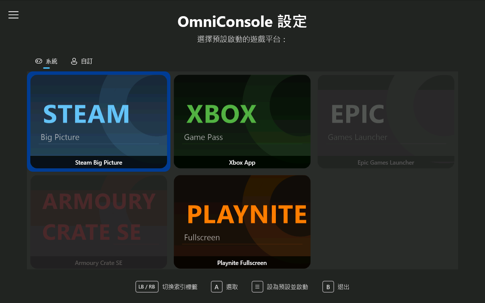
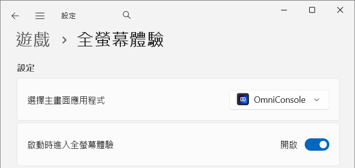

# OmniConsole

> 🌐 [English](README.md) | **繁體中文**

<p align="center">

</p>

<p align="center">
  
</p>

<p align="center">
<a href="https://github.com/8bit2qubit/OmniConsole/releases/latest"></a>
<a href="https://github.com/8bit2qubit/OmniConsole/releases"></a>
<a href="#"></a>
<a href="https://github.com/8bit2qubit/OmniConsole/blob/main/LICENSE"></a>
</p>

一個自訂的 **WinUI 3 遊戲平台啟動器**，設計用來取代 Windows 11 預設的**全螢幕體驗 (FSE) 首頁 Shell**，為遊戲 PC 和掌機提供無縫的主機風格開機體驗。

---

## 💡 什麼是 OmniConsole？

OmniConsole 作為 Windows 11 全螢幕體驗 (FSE) 首頁 Shell，在您的 PC 或掌機裝置（ROG Xbox Ally 等）上，每當全螢幕體驗被觸發時自動啟動您選擇的遊戲平台。系統預設的全螢幕體驗首頁僅支援啟動 Xbox App，而 OmniConsole 突破了這項限制，讓您自由選擇要啟動的遊戲平台：

- **開機時**：啟用「啟動時進入全螢幕體驗」後，開機即自動啟動您設定的遊戲平台。
- **使用中**：按下 **Xbox 鍵**，點選 Game Bar 的「**首頁**」或「**媒體櫃**」即可啟動遊戲平台。（「媒體櫃」預設開啟 OmniConsole 設定。）

### 運作方式

> 觸發（開機 / Xbox 鍵 → Game Bar「首頁」或「媒體櫃」/ 開始功能表 → OmniConsole）  
> → OmniConsole 啟動  
> → 已在 FSE 中：啟動您選擇的遊戲平台 → OmniConsole 隱藏並結束  
> → FSE 模式外：FSE 進入對話方塊 → 確認 → 在 FSE 中重新啟動 → 啟動您選擇的遊戲平台 → OmniConsole 隱藏並結束

---

## ✨ 功能特色

- **自動平台啟動** – 啟動時自動開啟已設定的遊戲平台。
- **自動進入 FSE** – 在 FSE 模式外啟動（如從開始功能表），OmniConsole 會自動觸發 FSE 進入對話方塊。
- **多平台支援** – 支援 **Steam Big Picture**、**Xbox App**、**Epic Games Launcher**、**Armoury Crate SE** 與 **Playnite Fullscreen**。
- **卡片網格設定介面** – 大圖示卡片版型，適合大螢幕與掌機使用，可透過滑鼠、觸控或 Xbox 手把操作。
- **Game Bar 整合** – 自訂 Game Bar「**首頁**」與「**媒體櫃**」按鈕的行為：開啟 OmniConsole 設定、啟動遊戲平台，或直接導向 Xbox App 等平台。
- **疑難排解頁面** – 專屬頁面提供緊急修復途徑：結束 Game Bar 並繞過 FSE 確認對話方塊，直接進入 FSE。
- **手把完整支援** – 使用**方向鍵**或**左搖桿**在設定介面及平台卡片網格中導覽，按 **A 鍵**確認選取，按 **B 鍵**退出。
- **專屬設定入口** – 在「所有應用程式」中獨立顯示「**OmniConsole 設定**」，隨時可更改預設平台。
- **原生 FSE 整合** – 透過 Windows 11 全螢幕體驗 API 註冊為首頁應用程式。

---

## ⚙️ 前置條件

在安裝 OmniConsole 之前，您需要先啟用 Windows 11 的全螢幕體驗功能：

- **桌上型電腦 / 筆記型電腦**：請先使用 [Xbox Full Screen Experience Tool](https://github.com/8bit2qubit/XboxFullScreenExperienceTool) 啟用 FSE 功能。
- **原生掌機裝置**（如 ROG Xbox Ally 系列）：這些裝置已原生支援 FSE，無需使用 Xbox Full Screen Experience Tool，可直接安裝 OmniConsole。

---

## 🚀 快速入門

### 1. 安裝 OmniConsole

1.  前往**設定 → 系統 → 進階**，啟用**開發人員模式**。
2.  從[**發布頁面**](https://github.com/8bit2qubit/OmniConsole/releases/latest)下載最新的 `.msix` 安裝套件與 `.cer` 憑證檔。
3.  點兩下 `.cer` 檔案 → 點選**安裝憑證** → 存放區位置選擇**本機電腦** → **將所有憑證放入以下存放區** → 瀏覽 → 選擇**受信任的人** → 完成。
4.  點兩下 `.msix` 檔案進行安裝。

### 2. 設定預設平台

OmniConsole 會在**首次啟動**或**應用程式更新後**彈出設定介面。您也可以隨時手動開啟：

1.  從開始功能表（所有應用程式）中開啟「**OmniConsole 設定**」。
2.  從卡片網格中選擇您偏好的遊戲平台。支援使用**滑鼠**、**觸控**或 **Xbox 手把**（**方向鍵/左搖桿**四向移動，**A 鍵**確認）：
    - **Steam Big Picture**
    - **Xbox App**
    - **Epic Games Launcher**
    - **Armoury Crate SE**
    - **Playnite Fullscreen**

    選取後會自動儲存，完成後按下手把 **B 鍵**或點選**退出**即可。

### 3. 設為 FSE 首頁應用程式

<p>
  
</p>

1.  前往**設定 → 遊戲 → 全螢幕體驗**。
2.  將「選擇首頁應用程式」設為 **OmniConsole**。
3.  啟用「**啟動時進入全螢幕體驗**」（**強烈建議**）。

### 4. 完成！

您的遊戲平台現在可透過以下任一方式啟動：

- **Game Bar**：按下 **Xbox 鍵**，點選「**首頁**」或「**媒體櫃**」。（「媒體櫃」預設開啟 OmniConsole 設定。）
- **開機**：啟用「**啟動時進入全螢幕體驗**」即可開機自動啟動。
- **開始功能表**：直接啟動 OmniConsole 即可自動觸發進入全螢幕體驗 (FSE)。

---

## 🔄 如何還原

> ⚠️ **解除安裝前，請務必先變更 FSE 首頁應用程式設定。** 若在 OmniConsole 仍設為 FSE 首頁應用程式的情況下直接解除安裝，Windows **工作檢視將無法正常開啟**。這是 Windows 本身的 Bug。

1. 前往**設定 → 遊戲 → 全螢幕體驗**。
2. 將「選擇首頁應用程式」改為 **Xbox** 或 **無**。
3. 從**設定 → 應用程式 → 已安裝的應用程式**中解除安裝 **OmniConsole**，或在開始功能表中對 **OmniConsole** 按右鍵選擇**解除安裝**。

---

## 🛠️ 疑難排解

如果您遇到因 Windows 本身的 Bug 導致全螢幕體驗 (FSE) 進入對話方塊（「重新啟動以提升效能」）遲遲未出現的問題：

1. 從開始功能表開啟 **OmniConsole 設定**。
2. 透過左側導覽選單切換至 **疑難排解** 頁面。
3. 在 **「結束 Game Bar 並進入 FSE」** 旁點選 **「執行」** 按鈕。這將會結束 Game Bar 並繞過 FSE 確認對話方塊，直接進入 FSE。

---

## 💻 技術堆疊

- **主要堆疊**：C# & .NET 8
- **UI 框架**：WinUI 3
- **封裝**：MSIX

---

## 🛠️ 本機開發

1.  **複製儲存庫**

    ```bash
    git clone https://github.com/8bit2qubit/OmniConsole.git
    cd OmniConsole
    ```

2.  **以 Visual Studio 開啟**

    使用 Visual Studio 2022 (17.0+) 開啟 `OmniConsole.sln`。確保已安裝 **WinUI 應用程式開發** 工作負載。

3.  **開發模式執行**

    將組建設定設為 `Debug`，選擇平台（`x64` / `ARM64`），按 `F5` 建置並執行。

---

## 🌟 星標歷史紀錄 (Star History)

<a href="https://star-history.com/#8bit2qubit/OmniConsole&Date">
  <picture>
    <source media="(prefers-color-scheme: dark)" srcset="https://api.star-history.com/svg?repos=8bit2qubit/OmniConsole&type=Date&theme=dark" />
    <source media="(prefers-color-scheme: light)" srcset="https://api.star-history.com/svg?repos=8bit2qubit/OmniConsole&type=Date" />
    
  </picture>
</a>

---

## 📄 授權

本專案採用 [GNU 通用公共授權條款第 3 版 (GPL-3.0)](https://github.com/8bit2qubit/OmniConsole/blob/main/LICENSE) 授權。

您可以自由使用、修改和散佈本軟體，但任何衍生作品必須以**相同的 GPL-3.0 授權條款散佈並提供完整原始碼**。詳情請參閱 [GPL-3.0 官方條款](https://www.gnu.org/licenses/gpl-3.0.html)。
